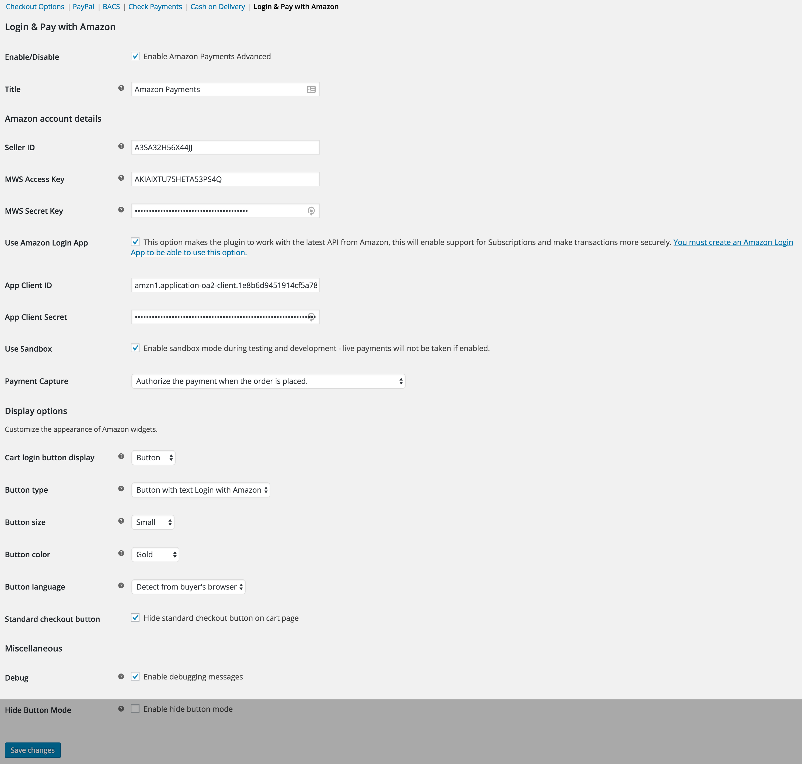
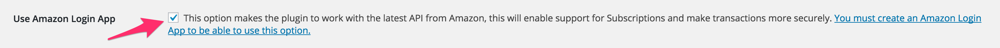
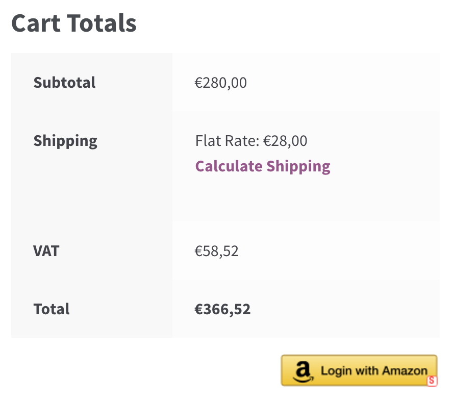
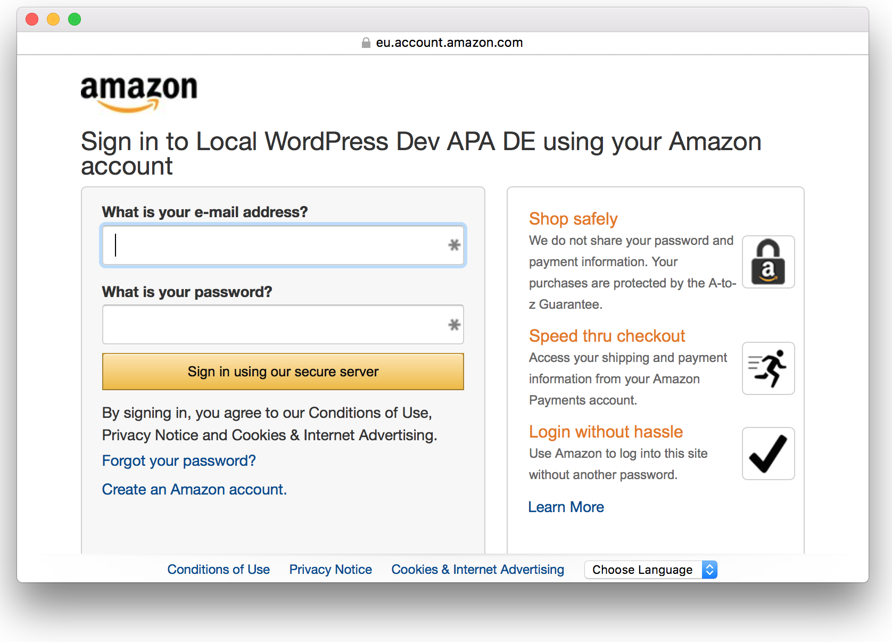
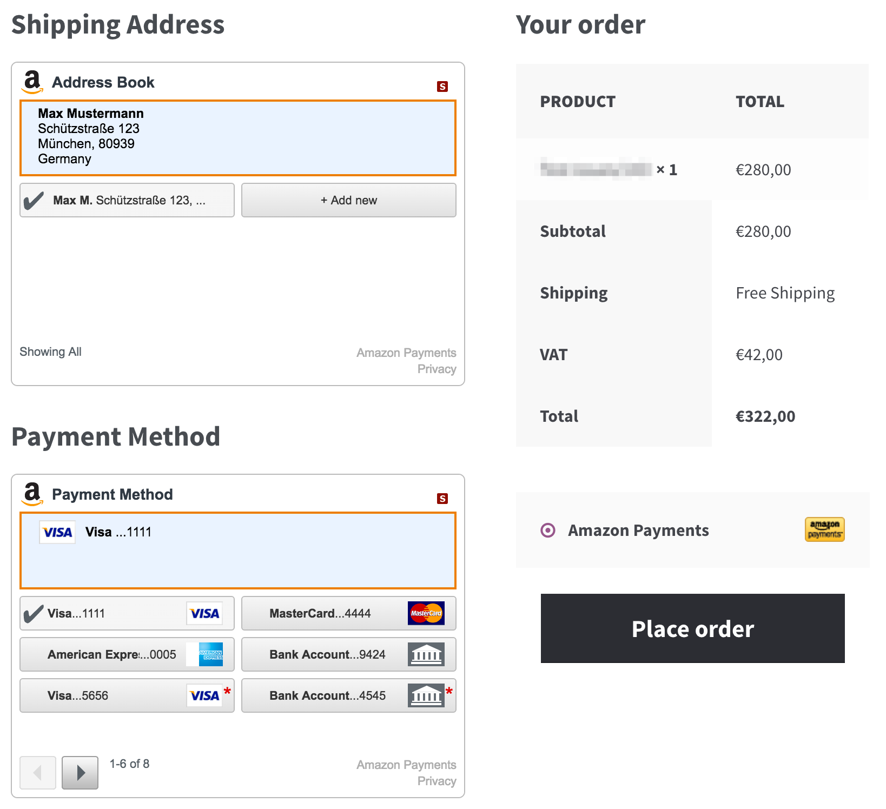
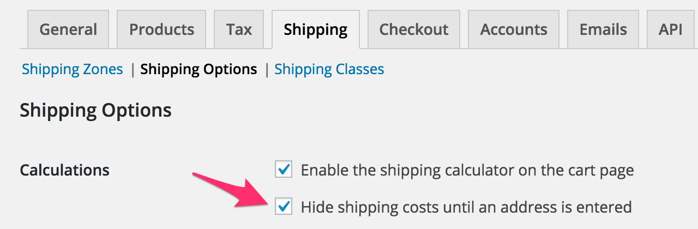

Amazon Pay User Documentation
=============================

[Amazon Pay](http://woocommerce.com/products/pay-with-amazon/?_ga=1.37349536.1089344366.1467581921) extends WooCommerce, allowing you to take payments via a special checkout page in your store powered by Amazon widgets. This offers a convenient way for Amazon users to pay using existing payment and address details.

This extension works for stores based in US, Europe, and Japan. Recurring payments with WooCommerce Subscriptions is supported, except for Germany and UK in which merchants need to [contact Amazon](https://payments.amazon.com/contact) and enable it via filter.

> **Note**: An [SSL certificate](http://docs.woocommerce.com/document/ssl-and-https/) is required for Amazon Pay. Please contact your hosting provider to purchase and install on your site.

## Table of Contents

* [Installation](#installation)
* [Sign up with Amazon](#sign-up-with-amazon)
* [Setup and Configuration](#setup-and-configuration)
* [Selling Free Items with Shipping](#selling-free-items-with-shipping)
* [Customer Checkout Flow](#customer-checkout-flow)
  * [Cart sign-in widget](#cart-sign-in-widget)
  * [Checkout sign-in widget](#checkout-sign-in-widget)
  * [Signing in](#signing-in)
  * [Amazon Checkout Page](#amazon-checkout-page)
* [Admin Order Fulfillment Flow](#admin-order-fulfillment-flow)
* [REST API](#rest-api)
  * [List of orders paid via Amazon Pay](#list-of-orders-paid-via-amazon-payments)
  * [Authorize the order](#authorize-the-order)
  * [Close authorization](#close-authorization)
  * [Capture the order](#capture-the-order)
  * [Authorize and capture the order](#authorize-and-capture-the-order)
  * [Refund the order](#refund-the-order)
* [FAQ](#faq)
  * [Will this gateway work with X extension that modifies the WooCommerce checkout page?](#will-this-gateway-work-with-x-extension-that-modifies-the-woocommerce-checkout-page)
  * [Can I use Pay with WooCommerce Subscriptions?](#can-i-use-pay-with-amazonamazon-payments-advanced-with-woocommerce-subscriptions)
  * [Where should I go to view my Amazon account balance?](#where-should-i-go-to-view-my-amazon-account-balance)
  * [My Amazon Pay widgets look stretched or distorted on my mobile device. How do I resolve this?](#my-amazon-payments-widgets-look-stretched-or-distorted-on-my-mobile-device-how-do-i-resolve-this)
* [Troubleshooting](#troubleshooting)
  * [Shipping costs are missing](#shipping-costs-are-missing)

## Installation

1. **Download** the .zip file from your [WooCommerce.com account](https://woocommerce.com/my-account/downloads/?_ga=1.206734355.1089344366.1467581921).
1. **Go to: WordPress Admin > Plugins > Add New** to upload the file you downloaded with Choose File.
1. **Activate** the extension.

More information at: [Installing and Managing Plugins](http://codex.wordpress.org/Managing_Plugins#Installing_Plugins).

## Sign up with Amazon

You need to register for a Pay with Amazon Merchant account at the following link(s), depending on your location:

* [US – Pay with Amazon](http://go.amazonservices.com/WooCommerce25.html)
* [UK – Pay with Amazon](https://payments.amazon.co.uk/business/pre-registration-api?ld=SPEXUKAPAWoocommerce)
* [DE – Bezhalen über Amazon](https://payments.amazon.de/business/pre-registration-api?ld=SPEXUKAPAWoocommerce)
* [JP – Amazonペイメント](https://payments.amazon.co.jp/home)

## Setup and Configuration



1. **Go to: WooCommerce > Settings > Checkout > Amazon Pay**.
1. **Tick** the box to Enable.
1. **Enter** Merchant account details provided by Amazon after signup:
  1. **Seller ID**
  1. **MWS Access Key**
  1. **Secret Key**
  1. **Use Login App** &mdash; Tick the box if you signed up for this option. Complete the App Client ID and App Client Secret fields that appear.
1. **Tick** the **Use Sandbox** box for testing only. *No live payments are taken*.
1. **Payment Capture** – From the dropdown, select how payments are handled.
  1. **Authorize and capture** &mdash; After placing the order, payment is automatically captured.
  1. **Authorize** &mdash; After placing the order, the payment is automatically authorized, but you need to manually capture later.
  1. **Don’t authorize** &mdash; After placing the order, you need to manually capture and authorize payment. Useful for pre-orders.
1. **Select** button or banner from the dropdown for **Cart login display**.
1. **Tick** the box to hide standard checkout button (optional).
1. **Tick** the Debug box if you wish to log errors. This is helpful for troubleshooting.

Retrieve your account details by logging into Amazon’s Seller Central. Your Seller ID is located under **Settings > Integration Settings** and your MWS Access and Secret Keys under **Integration > MWS Access Key**. Seller Central is located at:

* US: https://sellercentral.amazon.com
* EU: https://sellercentral-europe.amazon.com
* JP: https://sellercentral-japan.amazon.com/

Once configured, the plugin is ready to use.

## Selling Free Items with Shipping

If you’re selling zero-priced products in which you need to charge shipping:

1. **Go to: WooCommerce > Settings > Checkout > Pay with Amazon**.
1. **Tick** the checkbox for **Use Amazon Login App**.
1. **Save changes**.



## Customer Checkout Flow

To pay using Pay with Amazon, customers need to first sign in with their Amazon account.  They can do this from two places.

### Cart sign-in widget

On the cart page, customers see a Amazon Pay button next to the regular checkout button:



### Checkout sign-in widget

On the regular checkout page, customers see a banner asking if they want to use Amazon Pay:


### Signing in

Both buttons trigger a sign-in window that opens and looks similar to this:



After signing in, the customer is redirected to a special version of the checkout that shows Amazon widgets.

### Amazon Checkout Page

Upon reaching the checkout page, note that the regular billing and shipping forms are missing. This is normal — they have been replaced by Amazon widgets:



Customers choose their desired shipping address and payment method, and this refreshes the WooCommerce order totals as normal.

They then click the ‘Place Order’ button. This create an order in WooCommerce for you to process.

## Admin Order Fulfillment Flow

When an order comes in via Pay with Amazon, it is placed On Hold. If you view/edit the order, a new meta box appears on your Orders screen:


This widget allows you to perform the following actions:

* **Authorize** &mdash; Authorize a payment but do not capture yet. Amazon recommends capturing payment once you have verified the order and have begun processing it.
* **Authorize and Capture** &mdash; Capture the full order total amount.
* **Capture** &mdash; Capture an authorized payment. Amazon recommends capturing payment once you have fulfilled the order.
* **Close authorization** &mdash; Close an authorization and release funds without capturing.
* **Refund** &mdash; If you captured a payment that is still open, you can refund X amount.

After each action, an order note is created, noting the status.

To view your Amazon Pay merchant account balance, visit:

* US: https://sellercentral.amazon.com
* EU: https://sellercentral-europe.amazon.com
* JP: https://sellercentral-japan.amazon.com

## REST API

Since 1.6.0, Pay with Amazon exposes some functionalities through REST API.

The Pay with Amazon REST API allows you to authorize, capture, and close authorization.
The endpoint is `/wp-json/wc/v1/orders/<order_id>/amazon-payments-advanced/`.

### List of orders paid via Amazon Pay

There's no custom endpoint to retrieve list of orders paid via Amazon Pay. The built-in orders point can be used with
`_payment_method=amazon_payments_advanced` filter.

```
GET /wp-json/wc/v1/orders?filter[_payment_method]=amazon_payments_advanced
```

```
curl -g -X GET 'https://example.com/wp-json/wc/v1/orders?filter[_payment_method]=amazon_payments_advanced' -u consumer_key:consumer_secret
```

For CURL request that involves filter query (`[]`), you need to specify `-g` (to turn off [URL globbing](http://ec.haxx.se/cmdline-globbing.html)).

JSON response example:

```
[
  {
    "id": 132,
    "status": "on-hold",
    "order_key": "wc_order_57bb41b6eeb32",
    "number": 4606,
    "currency": "GBP",
    ...
    "amazon_reference": {
      "amazon_reference_state": "Open",
      "amazon_reference_id": "S02-0312204-2022855",
      "amazon_authorization_state": "",
      "amazon_authorization_id": "",
      "amazon_capture_state": "",
      "amazon_capture_id": "",
      "amazon_refund_ids": []
    },
    ...
  },
  ...
]
```

Orders paid via Amazon Pay will have `amazon_reference` on order item.

The `filter` parameter can be used with `status` parameter to retrieve list of orders that have been authorized but not captured yet.

```
curl -g -X GET 'https://example.com/wp-json/wc/v1/orders?filter[_payment_method]=amazon_payments_advanced&filter[amazon_authorization_state]=Open&status=on-hold' -u consumer_key:consumer_secret
```

### Authorize the order

```
POST /wp-json/wc/v1/orders/<order_id>/amazon-payments-advanced/authorize 
```

```
curl -X GET 'https://example.com/wp-json/wc/v1/orders/123/amazon-payments-advanced/authorize ' -u consumer_key:consumer_secret
```

JSON response example:

```
{
  "authorized": true,
  "amazon_authorization_id": "S02-6972444-9928455-A066187"
}
```

Possible JSON response with error:

```
{
  "code": "TransactionAmountExceeded",
  "message": "OrderReference S02-6972444-9928455 has already been authorized for amount 21.85 GBP. A new Authorization with amount 21.85 GBP cannot be accepted as the total Authorization amount cannot exceed 25.13 GBP.",
  "data": null
}
```

```
{
  "code": "woocommerce_rest_order_invalid_id",
  "message": "Invalid order ID.",
  "data": {
    "status": 404
  }
}
```

### Close authorization

```
POST /wp-json/wc/v1/orders/<order_id>/amazon-payments-advanced/close-authorization 
```

```
curl -X GET 'https://example.com/wp-json/wc/v1/orders/123/amazon-payments-advanced/close-authorization ' -u consumer_key:consumer_secret
```

JSON response example:

```
{
  "authorization_closed": true
}
```

Possible JSON response with error:

```
{
  "code": "woocommerce_rest_order_missing_amazon_authorization_id",
  "message": "Specified resource does not have Amazon authorization ID",
  "data": {
    "status": 400
  }
}
```

### Capture the order

```
POST /wp-json/wc/v1/orders/<order_id>/amazon-payments-advanced/capture 
```

```
curl -X GET 'https://example.com/wp-json/wc/v1/orders/123/amazon-payments-advanced/capture ' -u consumer_key:consumer_secret
```

JSON response example:

```
{
  "captured": true,
  "amazon_capture_id": "S02-6972444-9928455-C066187"
}
```

Possible JSON response with error:

```
{
  "code": "InvalidAuthorizationStatus",
  "message": "Authorization S02-6972444-9928455-A066187 is currently in Closed state. Capture can only be requested in Open state.",
  "data": null
}
```

### Authorize and capture the order

```
POST /wp-json/wc/v1/orders/<order_id>/amazon-payments-advanced/authorize-and-capture 
```

```
curl -X GET 'https://example.com/wp-json/wc/v1/orders/123/amazon-payments-advanced/authorize-and-capture ' -u consumer_key:consumer_secret
```

JSON response example:

```
{
  "authorized": true,
  "amazon_authorization_id": "S02-4966596-9591203-A079366",
  "captured": true,
  "amazon_capture_id": "S02-4966596-9591203-C079366"
}
```

Possible JSON response with error:

```
{
  "code": "InvalidAuthorizationStatus",
  "message": "Authorization S02-6972444-9928455-A066187 is currently in Closed state. Capture can only be requested in Open state.",
  "data": null
}
```

### Refund the order

```
POST /wp-json/wc/v1/orders/<order_id>/amazon-payments-advanced/refund
```

```
curl -X GET 'https://example.com/wp-json/wc/v1/orders/123/amazon-payments-advanced/refund' \
  -u consumer_key:consumer_secret \
  -H 'Content-Type: application/json' \
  -d '{"amount": "20.00", "reason": "reason for refund"}'
```

JSON response example:

```
{
  "refunded": true,
  "amazon_refund_id": "S02-1228806-5112466-R043423"
}
```

## FAQ

### Will this gateway work with X extension that modifies the WooCommerce checkout page?

Generally, no. Amazon Pay uses its own forms for payment and shipping, so plugins that add or modify WC checkout may not work in these cases. Since 1.6.0, compatibilities with extensions that modify checkout page has been added. Those are extensions are:

* [WooCommerce Drip](https://woocommerce.com/products/woocommerce-drip/)
* [WooCommerce Dynamic Pricing](https://woocommerce.com/products/dynamic-pricing/)
* WooCommerce German Market

### Can I use Pay with Amazon Pay with WooCommerce Subscriptions?

Yes, this Amazon Pay integration supports recurring payments with [WooCommerce Subscriptions](https://woocommerce.com/products/woocommerce-subscriptions/?_ga=1.101887745.1089344366.1467581921) (separate purchase). More info at: [Subscription Payment Methods & Gateways](https://docs.woocommerce.com/document/subscriptions/payment-gateways/).

### Where should I go to view my Amazon account balance?

To view your Amazon Pay merchant account balance, visit http://sellercentral.amazon.com for the US; or https://sellercentral-europe.amazon.com) for Europe; or https://sellercentral-japan.amazon.com/ for Japan. Not payments.amazon.com, payments.amazon.co.uk or payments.amazon.de or payments.amazon.co.jp

### My Amazon Pay widgets look stretched or distorted on my mobile device. How do I resolve this?

Stretching or distortion of Amazon Pay widgets when viewing your website on a mobile device is largely due to the WordPress theme you’re using. It may add padding around the widgets, causing the irregular display.

To fix, add the following CSS code to “style.css” in your child theme; or the “style.css” file in your parent theme if you’re not yet using a child theme:

```
#amazon_addressbook_widget div, #amazon_wallet_widget div {
    min-width: 260px !important;

}
```

## Troubleshooting

### Shipping costs are missing

This can occur if the following option is enabled. Disabling should solve the issue:


